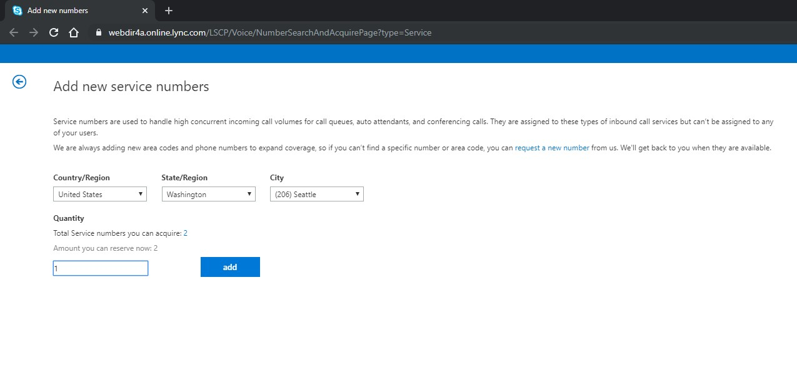
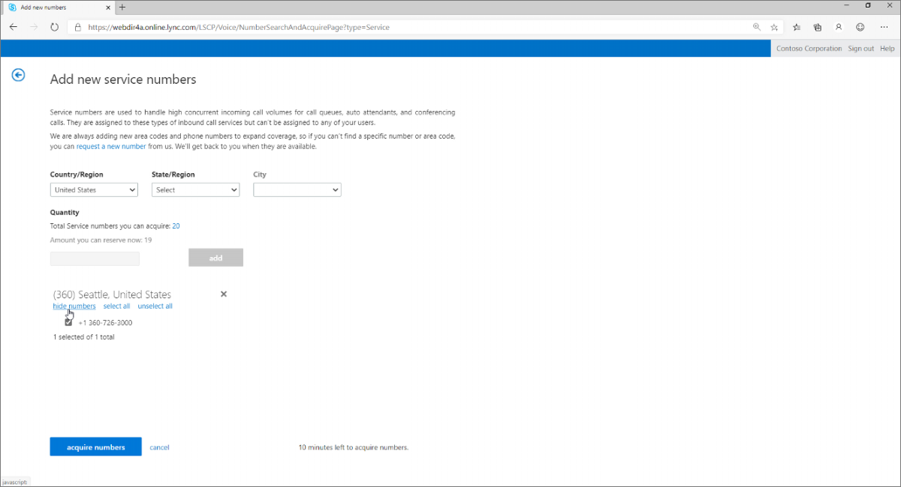
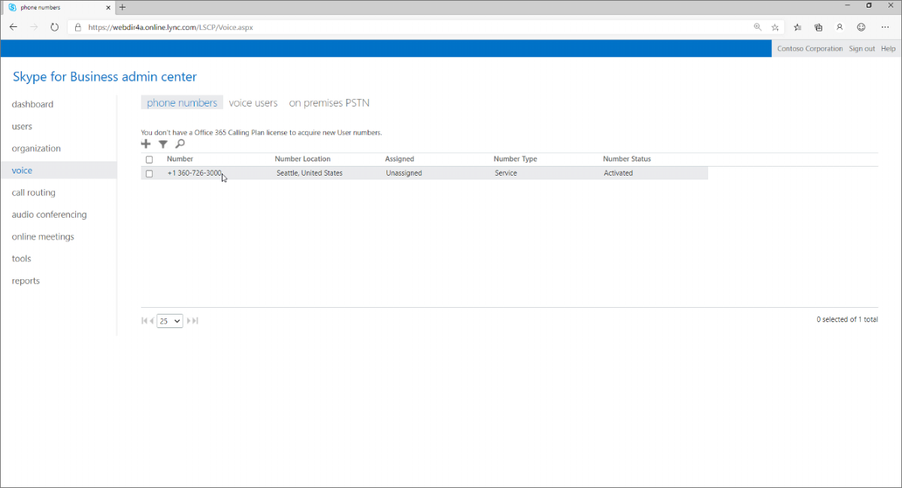
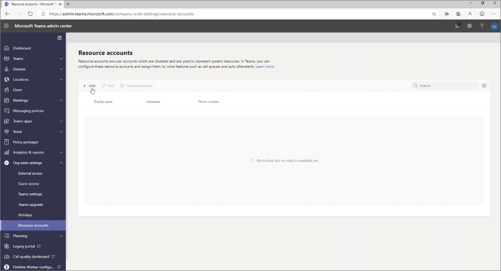
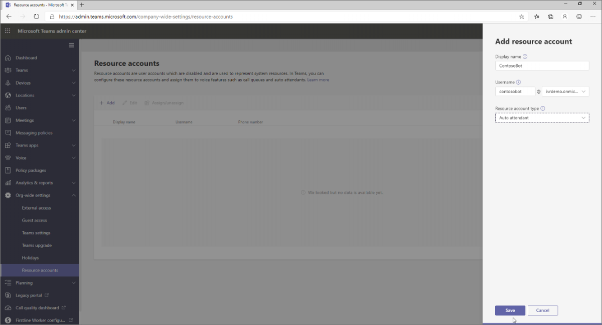
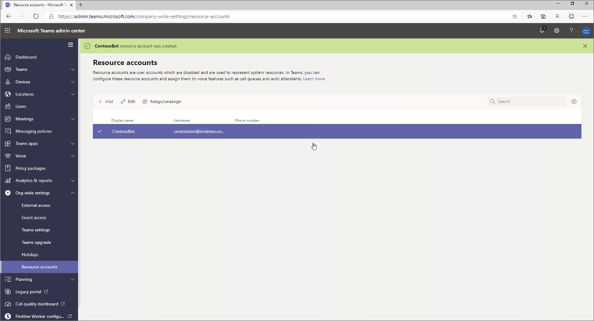
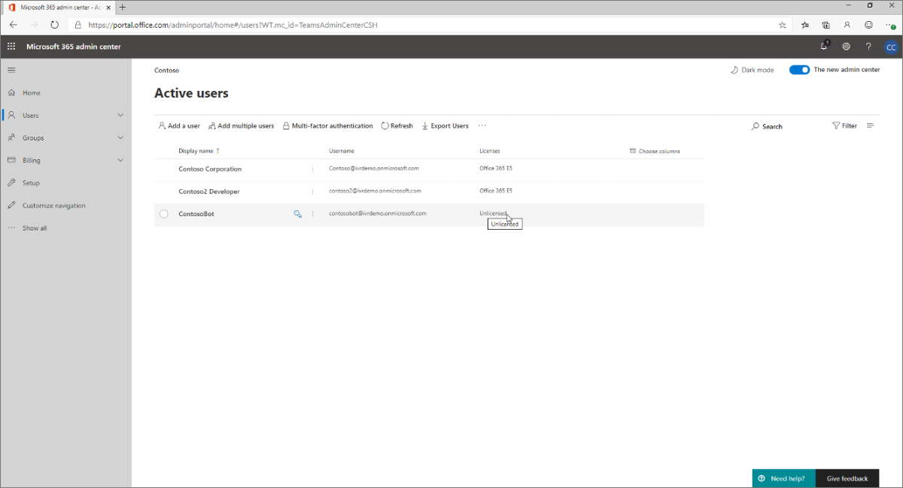
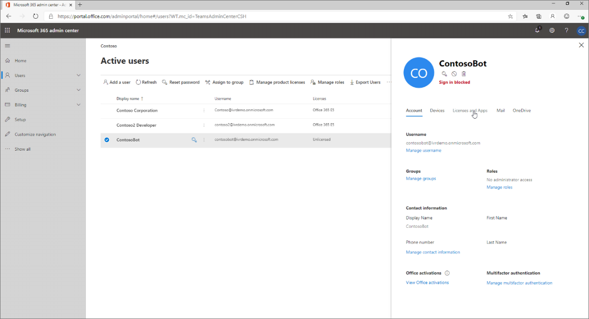
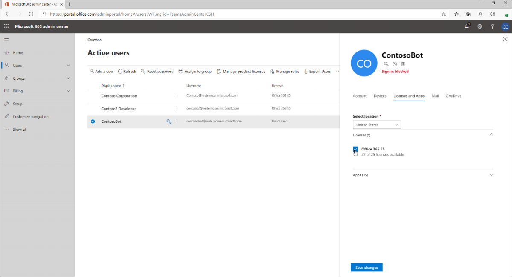
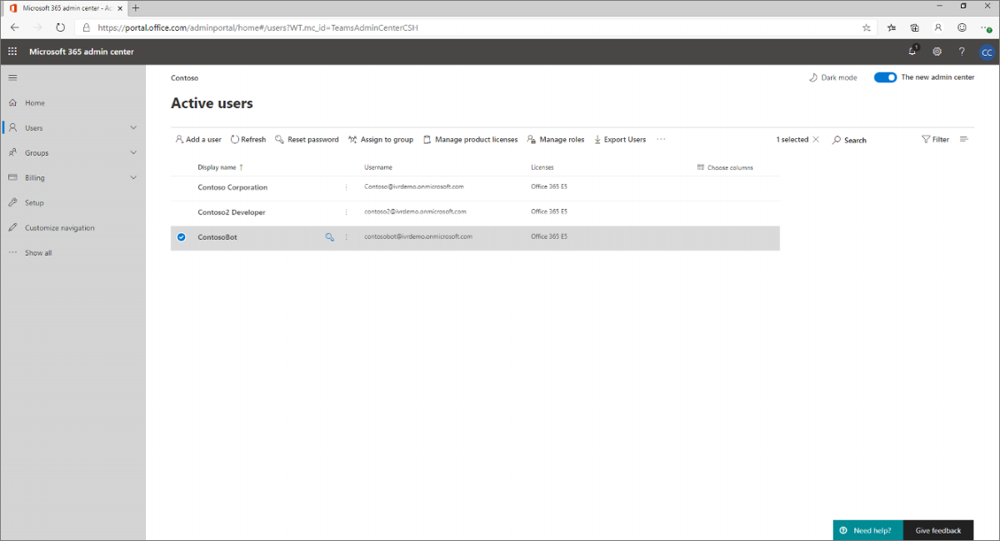

# Overview

The following is a step-by-step guide for acquiring phone numbers using Phone System in Office 365.

If your company already uses Microsoft Office, you probably already have an active license to provision phone numbers.  Contact your Office tenant admin (who creates new Outlook e-mail accounts when new employees join your company) to request new phone numbers using the instructions below.

# Requirements
Before you start the guide, make sure you meet the following requirements

**Phone System and calling plan licenses** - Ensure you have a valid Phone System and calling plan licenses. You will need one of the following:
  * An Office 365 E3 license + a calling plan 
  * An Office 365 E5 license.

**Admin permissions** You must have admin permissions to perform these steps ([Admin roles in Office 365](https://docs.microsoft.com/en-us/office365/admin/add-users/about-admin-roles?view=o365-worldwide)). .
This means
   * Either, all the steps are performed by "Global Administrator" for your organization
   * Or, "Microsoft Teams Admin" handles all the steps and "User/License admin" is needed for assigning the licenses.
   *  Alternatively, you can yourself buy a new [Office 365 License](https://aka.ms/ivr1) specifically for your bots. 
      * You can start a with a free trial and request a free extension of your free trial from us during testing and development of your IVR

<center>
<image src="images/o365License.png" width="70%">
</center>

Please note:

1. If you are having an issue at this step getting to this portal, try using incognito window to log into 
[Office Admin Center](https://www.office.com/?auth=2&login_hint={0}&from=AdminCenterEmail)
2. Please make sure you are logging in with Office 365 license admin credentials for your company - or the trial account credentials you create above!

# Summary

Overall setup can be broken down into following stages:


| Stage                                                   | Admin permission needed |
| ------------- | ------------- |
| [Acquire a phone number](#Acquire-a-phone-number)      | Global Adminstrator or Microsoft Teams Admin|
| [Create a resource account](#Create-a-resource-account)| Global Adminstrator or Microsoft Teams Admin|
| [Assign license](#Assign-license)                      | Global Adminstrator or User/License Admin|
| [Bind the phone number](#Bind-the-phone-number)        | Global Adminstrator or Microsoft Teams Admin|

## Acquire a phone number

Office 365 supports two types of phone numbers:  individual phone numbers, which are best for individual employees and support a limited number of concurrent calls, and service phone numbers that support many concurrent calls.  The second type, service phone numbers, are ideal for resource accounts - for example, conference rooms. 

We will use the second option (a service phone number allocated to a resource account) for our bot, so that it can support many concurrent calls at the same time.

Acquiring a phone number would require performing the following tasks in the following order:

### Step 1 - Go to [Skype for Business admin center](https://aka.ms/ivr2) > Voice
Click "+" to create a new Service number.


### Step 2 - Select New service numbers option:


### Step 3 - Choose Phone Number Area code
In the next page that follows, select the Country, Toll-Free/State/Region and a City to obtain a specific area code. Additionaly also specify the number of phone numbers you need.

If you will have several bots in your IVR as skills (you can develop each skill separately and transfer calls between those), you can obtain more than one phone number -  You can also use one phone number for pre-production, and one for production loads



**NOTE**:
 * Due to varying laws, not all countries are available in this dropdown. If your target country is not in the dropdown, you will need to follow instructions [here](https://docs.microsoft.com/en-us/microsoftteams/manage-phone-numbers-for-your-organization/manage-phone-numbers-for-your-organization?toc=/skypeforbusiness/toc.json&bc=/skypeforbusiness/breadcrumb/toc.json) and provide the "911" emergency local address required by local authorities for calls originating from that phone number.
* For IVR private preview customers, if you are unable to get phone numbers (for whatever reason) in the admin portal, you can also reach out to the number management team at gcstnmsd@microsoft.com. That team will work with you to provide the numbers you require.


### Step 4 - Acquire number(s)
The system will query available regional inventory of phone numbers and offer you several options.  You can uncheck phone numbers you do not want, and press Acquire Numbers for those numbers that you like:



## Success!!
You should now be able to see the new acquired phone number. Note down this number, since this will be needed later.



## Create a resource account
Once you have a phone number, next you need to create an identity that can "pick up" the calls (ie, identify who the calls will be redirected to when they come in), and assign that entity an Office 365 license.

Acquiring a phone number would require performing the following tasks in the following order:

### Step 1 - Go to [Resource Account portal](https://aka.ms/ivr3) > Org-wide settings > Resource Accounts

Click on Add to add a new resource account.  Creating a resource accounts is just like adding a new user to your company - just non-human (a conference rooms, a bot, a toll-free 1-800-Contoso line, etc).



### Step 3 - Add a new Resource Account 
Fill out the Display name of your bot, give it a username, and set the Resource Account Type = Auto Attendant.  Click Save at the bottom.
  * Note down the chosen resource name and domain name. This will be needed later in the [Binding stage](#Bind-the-phone-number)




## Success!
You now have a phone number, and the calls coming into this phone number can be routed to some entity - in this case, a resource account, identified by a login.   Next, we will assign one of your licenses to this account for the line to become active and have a dialtone.


## Assign license
If you are using an Office 365 E5 trial, your account comes with a pack of 25 licenses - ie, 25 live phone numbers anywhere in the world -  If you have a regular Office 365 account, you can use those licenses to license this resource account.   Let's license the resource account to enable the resource account to act on this phone number.

Assigning license to a resource account  would require performing the following tasks in the following order:

### Step 1 - Go to [Microsoft 365 admin center](https://aka.ms/ivr4) > Users > Active Users
The resource account you created should appear on the list.  Note that at the moment, Licenses column states "Unlicensed".  Let's activate this account so that it can pick up the phone by assigning an active license to it.  Click on the account name:

### Step 2 - Activate License



On the slide-out that opened, click on **Licenses and Apps**:



### Step 3 - Select License
Check an **Office 365 E5 license** - this license includes phone lines.


## Success!
You have created a phone number, provisioned an identity for a future bot that will be answering phone lines, and assigned a license to it.  You now have both pieces: a phone number and a licensed account that can answer phone lines.  However, the resource account is not assigned to answer this phone line yet. Let's bind the phone number to the resource account next.



## Bind the phone number
This is the last and most important part of the Phone number aquistion process where you would need to bind the acquired phone number backed with a resource account with assigned license. 

Here are the steps needed to complete the Phone number acquistion process
1. Download and install the [Skype for Business Online Connector module](https://www.microsoft.com/download/details.aspx?id=39366), and then restart your computer if prompted.

2. Connect using a Skype for Business Online administrator account with multifactor authentication
   *  Open a Windows PowerShell command prompt and run the following commands:
   ```
      Import-Module SkypeOnlineConnector
      $sfbSession = New-CsOnlineSession
      Import-PSSession $sfbSession
   ```
   * When prompted by the New-CsOnlineSession command, enter your Skype for Business Online administrator account name.
   * In the Sign in to your account dialog box, type your Skype for Business Online administrator password, and then click Sign in.
   * Follow the instructions in the Sign in to your account dialog box to provide additional authentication information, such as a verification code, and then click Verify.

3. Run the following command to complete the binding
   ```
      # Replace
      #  - resourceusername with user name chosen during Create a resource account > Add a new Resource Account domainname with the domain name for the Office 365 account. 
      #       e.g. "telephonyuser123@contoso.onmicrosoft.com"
      #  - $phoneNumber is one of the phone number acquired above

      $appInstance = Set-CsOnlineApplicationInstance `
          -Identity resourceusername@domainname.onmicrosoft.com `
          -ApplicationId daca305a-db90-4689-acff-90df749b5c78

      Sync-CsOnlineApplicationInstance -ObjectId $appInstance.ObjectId
      Set-CsOnlineVoiceApplicationInstance `
         -Identity $appInstance.UserPrincipalName `
         -TelephoneNumber $phoneNumber

   ```

**Note:**

Last command `Set-CsOnlineVoiceApplicationInstance` may fail with `CmdletInvocationException` due to longer delays in syncing the application instance (issued in previous command `Sync-CsOnlineApplicationInstance`). Please retry after few minutes if you run into this.

In the next step, we will bind the created bot with the phone number acquired in this guide.
